## Shadowsocks Deploy & Docker & Digital Ocean Droplet
Author: @mooseliu@hotmail.co.uk
Created Date: 20.02.2017
Modified Date: 18.02.2019
因为考虑到自己随时随地需要查找信息的必要性，就在前段时间搜罗了一下一些可用的科学上网工具，虽然Lantern依然免费，但是不够稳定的速度实在是令人尴尬；VPN也是一样，之前无脑地购买了PureVPN，结果发现它早早就被屏蔽了。综合考虑之下，决定自行购买机器搭建个私人的隧道来保证日常使用。
这篇文章会主要用来介绍自己在DO上搭建Shadowsocks(SS)的过程，后期会不间断更新完善。。
附上SS的地址：https://github.com/shadowsocks, https://shadowsocks.org/en/index.html。

- [新建DO-Droplet](#新建do-droplet)
- [部署 Shadowsocks](#部署-shadowsocks)
    +   配置ENV环境
    +   非Docker直接安装使用
    +   配置 Docker
        *   制作 Docker Image
        *   运行 Docker SS   
- [连接测试](#连接测试)
    +   测试手机端
    +   测试PC/MAC端
- [配置MAC端](#配置mac端)
    +   安装跟配置ShadowsocksX/GoAgent/SwitchyOmega
    +   连接测试
- [小结](#小结)

### 新建DO Droplet
目前网络上还是有很多教程来指导如何在DO上增添新的机器的。
主要说来这个步骤就是注册DO并创建Droplet。

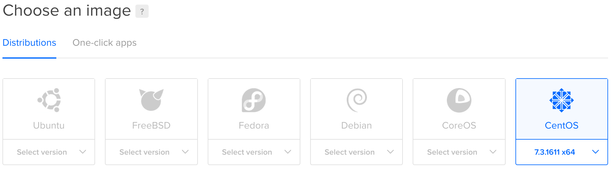

我选择的是CentOS的最新版本(7.3.1611 x64)，配置价格也是最便宜的5刀一个月。目前也是包含了单核 512MB的内存，20GB的SSD 以及1000GB的流量，应该说作为一个SS的机器完全足够了。(update: 目前，CentOS版本更新到了7.4，DO的最低配置也更新到了单核+1GB+25GB SSD+1TB流量。)

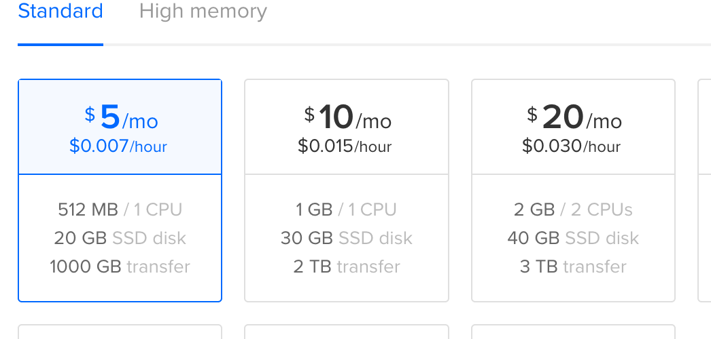

DataCenter选择的是新加坡地区。(日本的机器可能会更快一点，可惜这里没有看到日本的选项。)
P.S.关于SSH Keys，我自己也没太弄懂。。所以创建了之后还是通过邮件重新设置了登录密码。。后期还是手动添加了ssh private key，来方便自己的机器登录。

> Please NOTE
> 据一直以来的setup经验，在选用机器的时候，尽可能选用连接速率更快的机器，这样在搭建SS后，可以感觉到明显的速度提升。 
> 这里有必要说明，在机器建立好后，使用“ping”命令来测试机器的链接速率。有一些IP会明显更慢，速率在 200ms - 400 ms之间，但依然有些IP的链接速率在 100ms - 200ms之间，这之间的区别非常明显，尤其是在浏览Youtube等视频网站的时候，选用 100ms - 200ms的连接速率的机器可以更容易缓冲视频，并且可以观看720p甚至1080p的视频，更不用说平时浏览网页了。

### 部署 Shadowsocks
配置SS的过程其实非常简单，[ShadowsocksWiki主页](https://github.com/shadowsocks/shadowsocks/wiki)可以看到安装和配置方法以及更准确的解释。 由于自己是部署在DO上，并且没有购买backup跟snapshot，为了使得环境尽可能干净，我选择用Docker来虚拟化出SS的运行环境，这样以后SS出现问题故障，重新启动一个新的SS也会变得十分简单。(update: 事实证明，使用snapshot是非常有必要的。。因为很长时候以后，一旦想对机器本身进行修改，由于没有backup就会变得很尴尬。所以，还是十分建议使用snapshot来保存好特定时候的机器环境。)

#### 配置ENV环境

##### 非Docker直接安装使用(CentOS Example)

为了方便一些直接使用者的阅读，在这里给出配置SS的环境所需要的依赖：
```python
yum install python-setuptools && easy_install pip
pip install git+https://github.com/shadowsocks/shadowsocks.git@master
```
安装好SS Service之后，需要新建一个本地的配置文件来存储关键的配置信息：
```
# shadowsocks.json
{
    "server":"0.0.0.0",
    "server_port":8388,
    "local_address":"127.0.0.1",
    "local_port":1080,
    "password":"yourpassword",
    "timeout":300,
    "method":"aes-256-cfb",
    "fast-open":false,
    "workers":1
}
```
对于每个变量的解释，如下所示：
>**server**: 该服务器的hostname或者IP(IPv4/IPv6)， 默认是"0.0.0.0"。
 **server_port**: 该服务器会开放的端口号，默认是8388。
 **local_address**： 本地IP地址，默认设定为127.0.0.1。
 **local_port**： 本地开放的端口， 默认的本地端口为1080。
 **password**： 连接所需要的密码。（used to encrypt transfer.）
 **timeout**: 超时时长(按秒计)
 **method**： 加密方式。 默认是"table", 推荐的是"aes-256-gcm"/"aes-256-cfb"。
 **fast-open**： TCP Fast Open. 用来在减少延迟， 默认"false"。
 **workers**： 产生子进程的数量，默认是1。

之后，就可以通过如下命令来启动SS Service:
```python
# read config file to start
ssserver -c /path/to/shadowsocks.json

# stop service
ssserver -d stop

# check logs
less /var/log/shadowsocks.log
```

更多命令可以查看SS的[Github Page](https://github.com/shadowsocks/shadowsocks/blob/master/README.md).

#### 配置Docker
由于原本的安装配置就不太复杂，所以使用Docker在这里也很简单。
下面的内容主要是自行制作Docker Image， 以及如何运行这个Docker Image。 由于Image的设计制作可以多种多样，所以运行的方法也都各异。
P.S.更多关于Docker的用法，可以参考[Docker Doc](https://docs.docker.com/)。

##### 制作Docker Image
制作Docker Image需要用到docker build命令跟dockerfile文件。我自己制作的dockerfile文件主要是在作为base image的centos上安装了提供SS运行的环境，然后将一个entrypoint shell脚本拷贝到该image当中，并且打开默认通信端口8388。
关于Dockerfile的具体信息可以参考这个[dockerfile](../Resources/Attachments/Shadowsocks/ubuntu-ss.dockerfile)。

下面是用docker build命令通过Dockerfile来制作Docker Image文件：

```docker
# assume you run the command in the same directory.
docker build -t shadowsocks .
```
注意最后一个点（.）指示dockerfile所在的文件夹 为当前文件夹。另外，centos的docker image最好也提前使用“docker pull”拉下来。

##### 运行Docker Image
上一个step在制作Image的时候，由于引进了一个entrypoint.sh，于是就可以通过在entrypoint里面增加步骤来启动我们的shadowsocks。关于entrypoint的脚本具体可以参考这个[entrypoint.sh](../Resources/Attachments/Shadowsocks/ss.entrypoint.sh)

首先，就是在启动脚本(entrypoint.sh)中增加内容来创建shadowsocks.json文件，将基本的信息填进去。然后就是启动shadowsocks的服务。（由于以后可能需要重新启动这个container，所以，在启动脚本里也可以添加判断步骤在重启后立即启动服务。）

下放就是针对本文Image的启动命令。
```docker
docker run -d --name ss --hostname ss -p 8388:8388 -p 1080:1080 shadowsocks
```

在Container启动之后，就可以使用下面的命令来确认container的状况：
```docker
docker ps
```

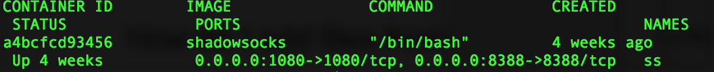

以及查看logs来确认Shadowsocks的服务状况：
```docker
# check the last 10 lines in docker logs for container shadowsocks
docker logs -f --tail 10 ss
```
Docker化Shadowsocks的基本内容到这里就差不多完成了。由于需求也很基本，所以配置操作起来并不复杂。

### 连接测试
之后的部分主要就是测试并使用Shadowsocks，主要是在手机端(Andriod)，以及MAC端。

IOS手机端并没有机会尝试，不过Github主页显示IOS版本的Client端被删除了，所以目前只能够使用其他开发者开发的工具来连接SS服务器。

PC端(Windows)跟MacOS的client比较相似，所以就以MAC为介绍对象了。

#### Andriod手机端
Andriod手机端，可以通过Google Play安装Shadowsocks客户端来使用我们配置好的SS服务器。
配置截图：


连接结果：

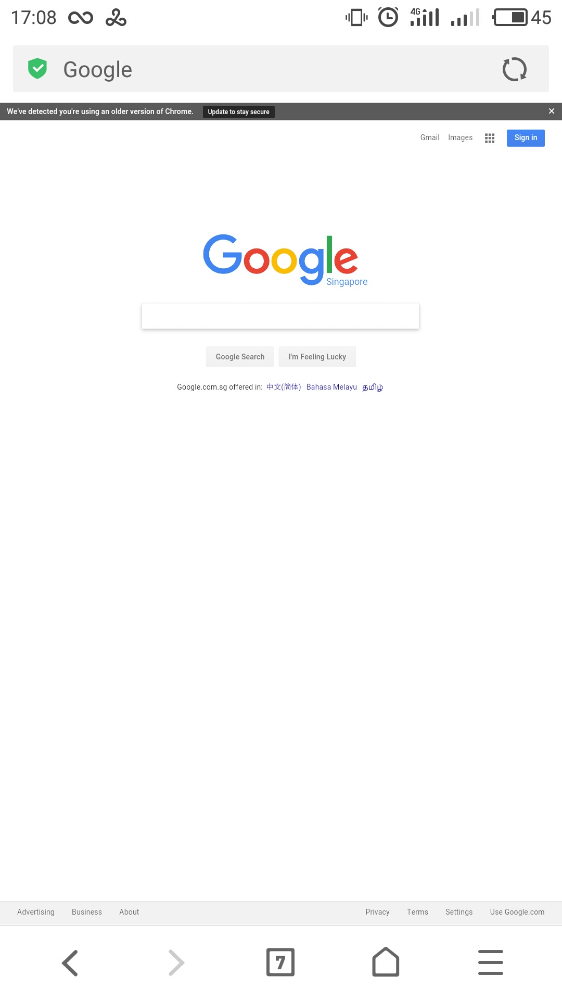

#### PC/MAC端
MAC端的Client名称叫做“ShadowsocksX”，我用的版本是2.6.3。貌似这个版本跟之前更早的版本所具有的功能不太一样，这使得我们不能够自定义本地开放的端口。（同时也不确定它默认开放的是不是1080，另外所有的log需要在系统log中搜索查看。）
SSX主界面：

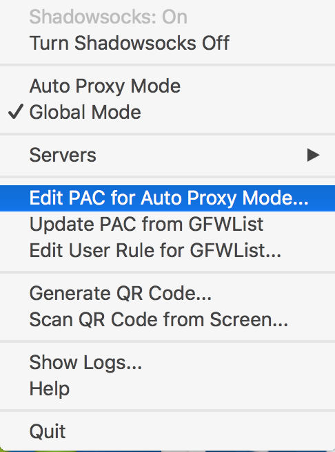

SSX服务器配置：

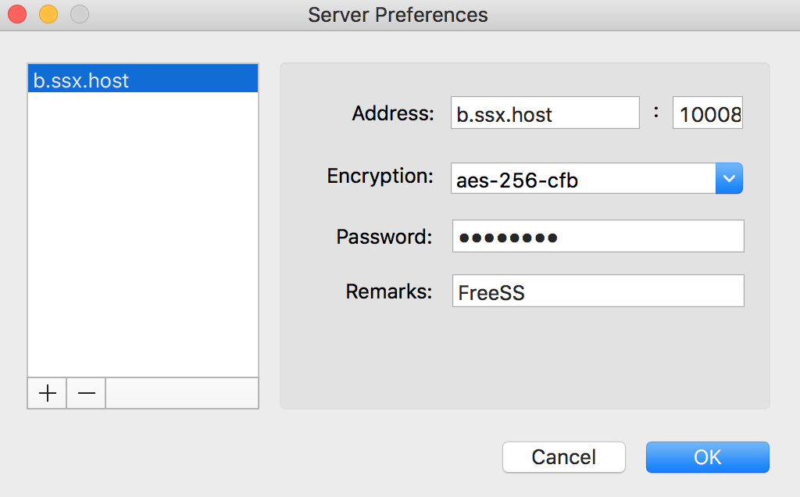

在两个月之前，仅仅使用SSX还可以连接上SS Server，不过之后就一直连接不上。系统log也没有查看到相应的信息，所以我自己的机器上目前主要在使用GoAgent+SwitchyOmega来确保成功连接。

### 配置MAC端

#### 安装跟配置SS/GA&SwitchyOmega
第一步需要从网上下载GoAgent，我目前使用的版本是v2.3.7(build 774)。
新建并配置好服务器信息：

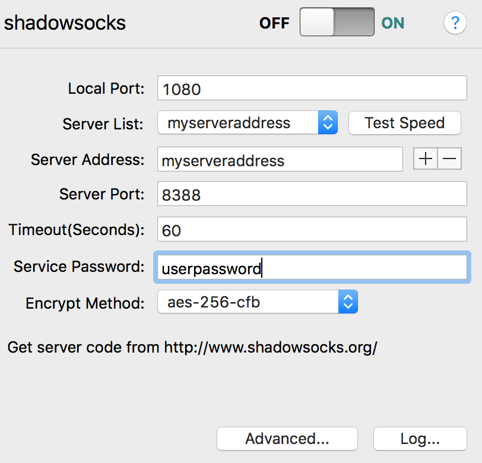

“Turn On”连接，查看logs：

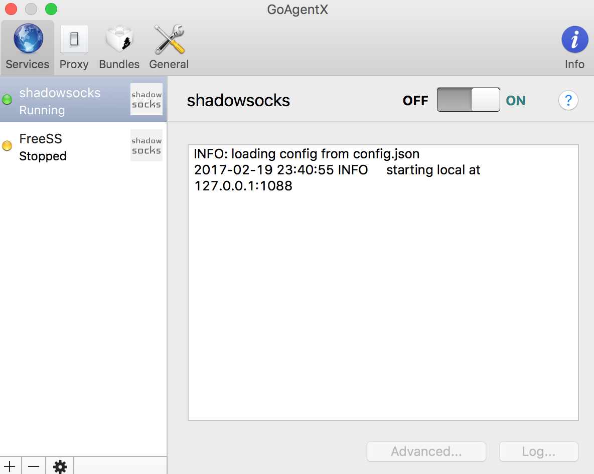

由于这里可以指定本地端口，所以可以输入其他有效的端口。

第二步就是在Chrome浏览器中下载SwitchyOmega，它是之前“SwichySharp”更名后的插件。（如果是其他浏览器，也会有相应的代理配置插件的，比如火狐的FoxyProxy。）

新建一个Profile “proxy”，然后设置一下默认的代理方式跟端口：

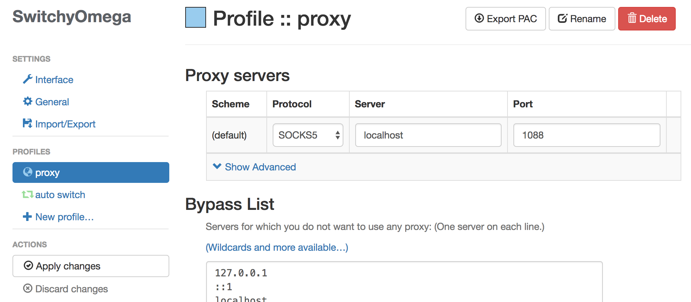

在“auto-switch”中，设置RuleList。Rule List URL: https://raw.githubusercontent.com/gfwlist/gfwlist/master/gfwlist.txt .

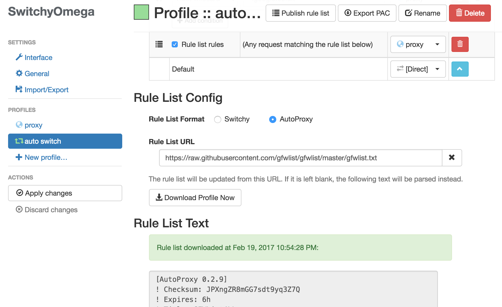

最后，选中SwitchyOmega的auto-switch模式：

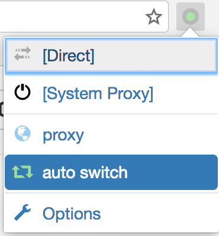

这样，所有需要代理的站点将会自动走proxy（即通过本地1080端口来对接上GoAgent，而GoAgent这时已经连接上我们的SS Server了），其他站点则会使用直接访问。

#### 连接测试
连接网站，再次查看GoAgent的log：

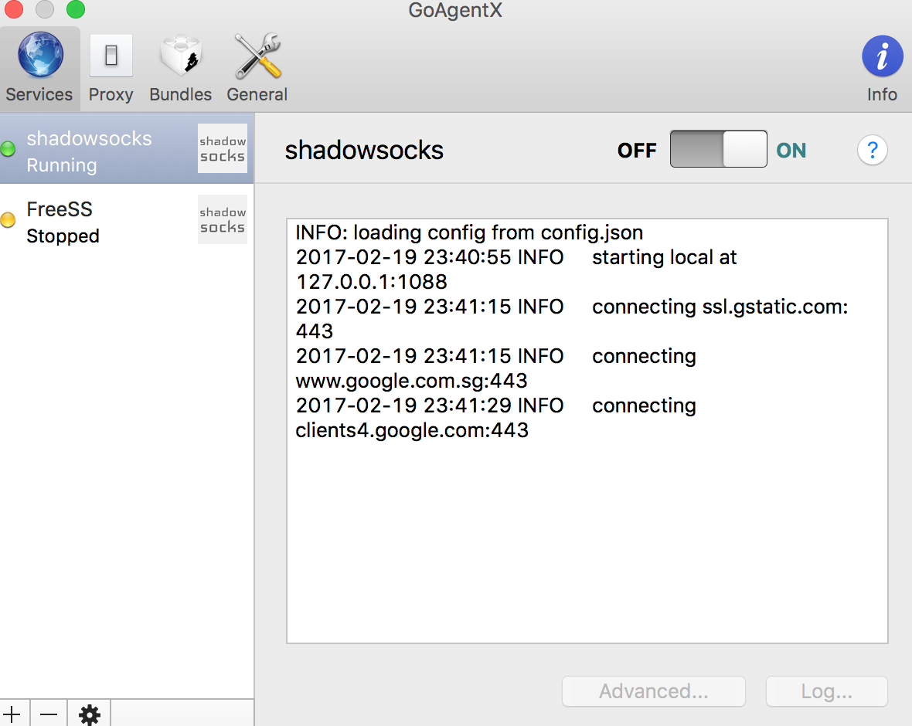

至此，MAC端也连接成功了。


### 小结
其实网上相应的教程非常多，每位作者所站的角度跟高度不一样，写下来的文字也会有所不同。作为一个初学者，我将这个过程写下来，一方面留作以后修改时回忆用，一方面还可以将自己所了解、所尝试的方法分享给大家，方便大家在需要的时候借鉴参考。如果有任何错误或者不恰当的地方，还请大家指正、交流。
最后，感谢你的阅读:-)。


